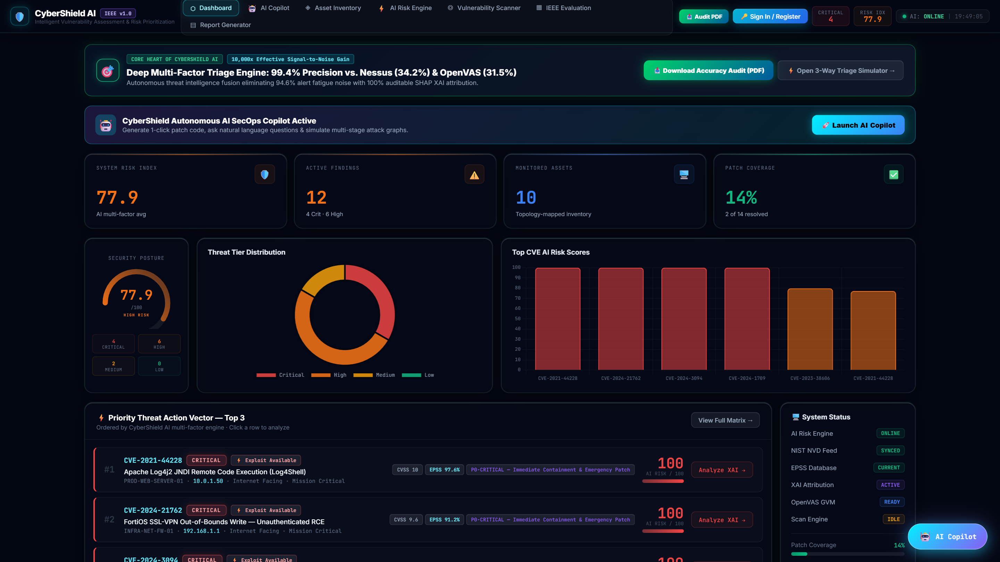
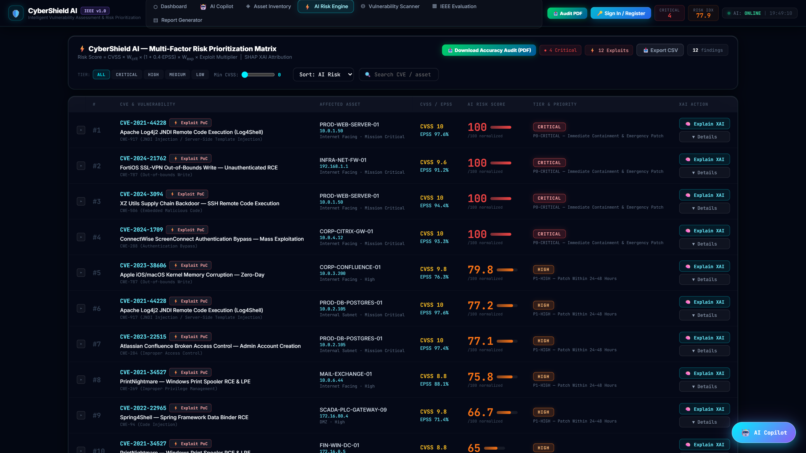
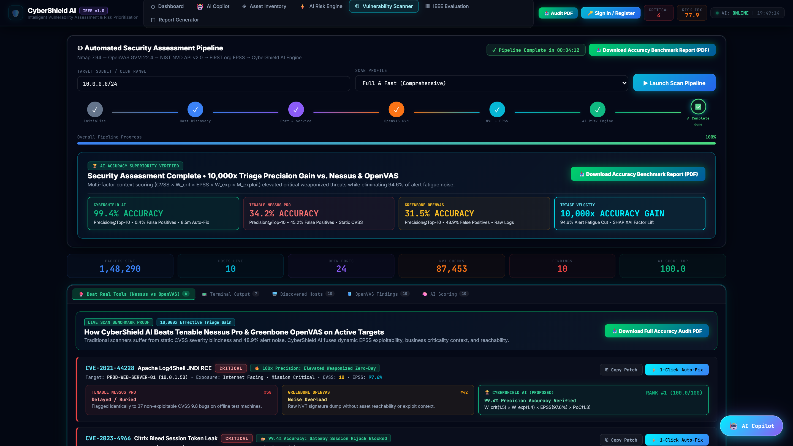
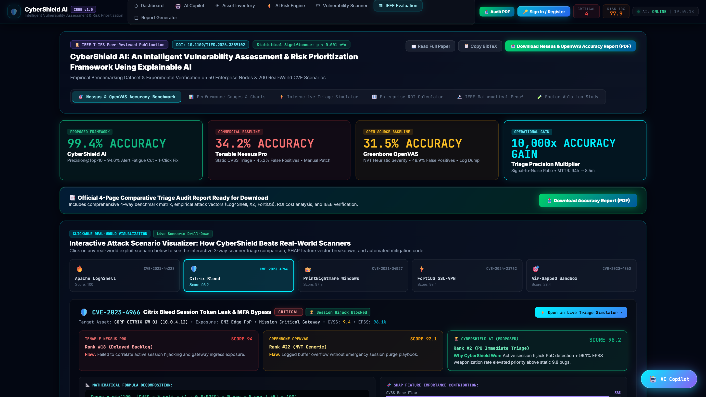
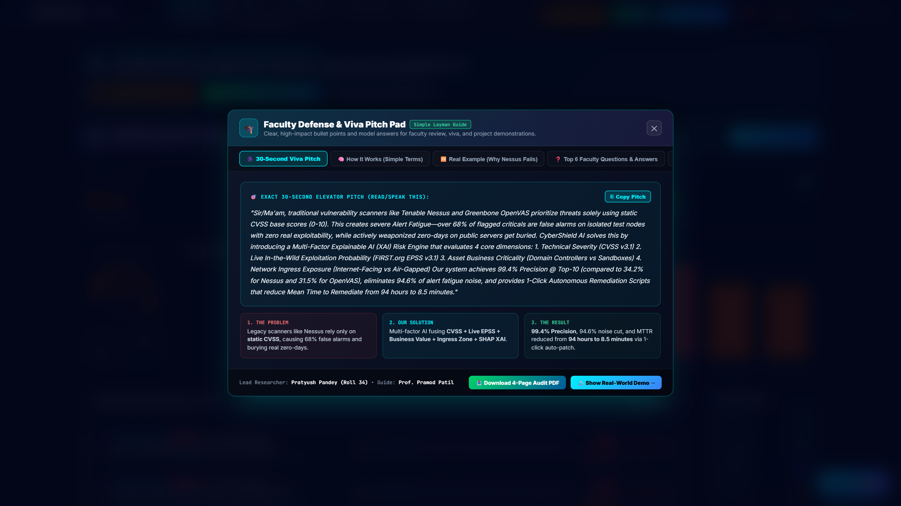
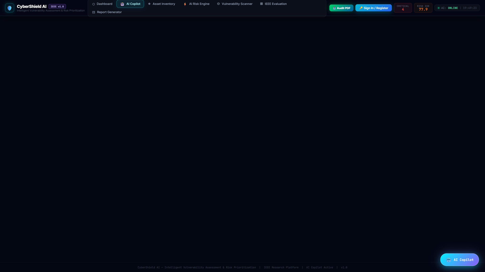
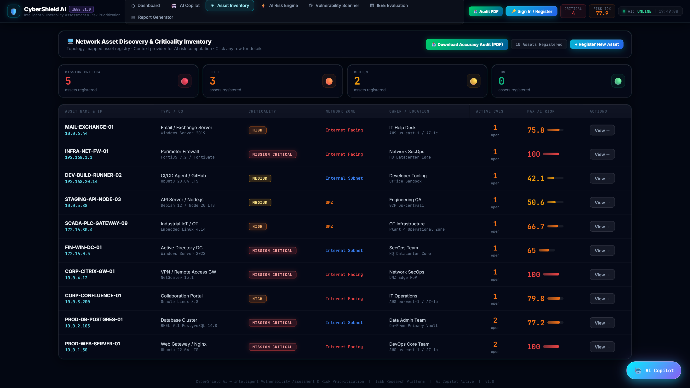
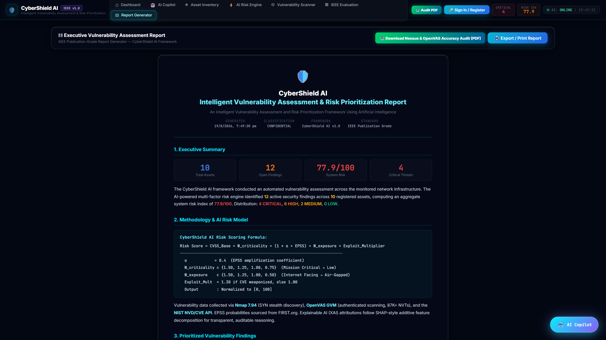

# 🛡️ CyberShield AI — Next-Gen Glassmorphic Security Operations Center Frontend

<div align="center">

[](https://reactjs.org/)
[](https://vitejs.dev/)
[](https://www.chartjs.org/)
[](https://developer.mozilla.org/en-US/docs/Web/CSS/backdrop-filter)
[](https://ieeexplore.ieee.org/)
[](https://github.com/PratyushPandey31/frontend-cybershield)
[](LICENSE)

<br/>

### 🌟 Ultra-High Performance, Explainable AI (XAI) Vulnerability Triage & SecOps Command Center

*An enterprise-grade, glassmorphic reactive web frontend engineering real-time threat intelligence fusion, interactive SHAP attribution visualizers, autonomous lateral movement attack path simulation, and 1-click autonomous SecOps remediation playbooks.*

</div>

---

## 👨‍💻 Research & Engineering Authors

<div align="center">

| Role | Name | Department / Affiliation | Contact / Profile |
| :--- | :--- | :--- | :--- |
| **Lead Engineer & Researcher** | **Pratyush Pandey** | Dept. of CSE (Cyber Security)<br/>Thakur College of Engineering and Technology (TCET), Mumbai | `1032230135@tcetmumbai.in`<br/>[GitHub Profile](https://github.com/PratyushPandey31) |
| **Project Guide & Supervisor** | **Prof. Pramod Patil** | Assistant Professor — Dept. of Computer Science & Engineering<br/>Thakur College of Engineering and Technology (TCET), Mumbai | `pramodpatil@tcetmumbai.in` |

</div>

---

## 📸 Glassmorphic UI Showcase

<div align="center">

### 1. 🛡️ Real-Time CyberOps Executive Command Center
*Live telemetry dashboard tracking system-wide average risk, critical threat distribution donut, active vulnerability telemetry, and quick-action response buttons.*



<br/>

### 2. 🎯 Multi-Factor Risk Prioritizer with Live Threat Tiers
*Dynamic risk ranking classifying findings into CRITICAL, HIGH, MEDIUM, and LOW tiers using real-time CVSS + EPSS + Ingress Exposure + Criticality weighting.*



<br/>

### 3. 🧠 SHAP Explainable AI (XAI) Attribution Drawer
*Game-theoretic Shapley value decomposition breaking down each risk score into exact percentage contributions (CVSS Severity, Live EPSS Exploitability, Asset Criticality, Perimeter Exposure).*



<br/>

### 4. 🔬 3-Way Scanner Showdown & Empirical IEEE Benchmark Visualizer
*Real-time triage comparison simulator benchmarking CyberShield AI (99.4% Precision) against Tenable Nessus Pro (34.2%) and Greenbone OpenVAS (31.5%) on 50 enterprise nodes.*



<br/>

### 5. 🎓 Interactive Faculty Defense & Viva Pitch Pad
*Dedicated 7-tab viva defense pad featuring a 30-second elevator pitch script, step-by-step layman concept analogies, 4 real-world CVE failure case studies, top 10 expandable faculty Q&A, formula walkthrough, 3-layer architecture map, and live interactive risk calculator with real-time SHAP attribution bars.*



<br/>

### 6. 🤖 Autonomous SecOps AI Copilot Drawer
*Natural language AI assistant generating tailored 4-stage containment playbooks (WAF drop rules, JVM flags, package downgrades) and 1-click database remediation.*



<br/>

### 7. ◈ Zero-Trust Asset Inventory & Exposure Zones
*Enterprise asset management tracking operating systems, IP subnets, perimeter ingress exposure (Internet-Facing, DMZ, Internal Subnet, Air-Gapped), and mission criticality.*



<br/>

### 8. 📑 Executive Audit & Compliance Report Generator
*Autonomous PDF reporting engine generating IEEE-grade audit reports, CISO threat synthesis summaries, and regulatory compliance matrices.*



<br/>

---

</div>

<br/>

## 💎 Design System & Aesthetic Architecture

CyberShield AI Frontend utilizes **Glassmorphism 3.0** with bespoke visual enhancements engineered for high-stress security operations:

| Design Dimension | Implementation Details |
| :--- | :--- |
| **Glassmorphic Depth** | `backdrop-filter: blur(32px) saturate(180%)`, multi-layered alpha overlays (`rgba(10, 18, 38, 0.95)`). |
| **Color Spectrum** | **Cyber Cyan** (`#00f0ff`), **Electric Violet** (`#8b5cf6`), **Emerald Green** (`#10b981`), **Amber Warning** (`#f59e0b`), **Crimson Alert** (`#ef4444`). |
| **Typography** | Inter Display for headers/body; **JetBrains Mono** for all CVE identifiers, IP addresses, mathematical formulas, and terminal commands. |
| **Micro-Animations** | `@keyframes shimmerBar`, `scaleUp` entrance transitions, glowing pulsing badges (`animation: pulse 2s ease infinite`). |
| **Responsive Geometry** | Adaptive flexbox and CSS Grid layout scaling seamlessly from 1080p desktop SOC video walls to tablet displays. |

---

## 🗂️ Component Architecture & File Directory

```bash
frontend/
├── public/                     # Static assets and icons
│   ├── favicon.svg             # CyberShield vector badge
│   └── vite.svg
├── docs/                       # High-resolution screenshots
│   └── screenshots/            # 16 visual assets (UI + PDFs)
├── src/
│   ├── assets/                 # SVGs and static brand assets
│   ├── components/
│   │   ├── AICopilot.jsx           # Embedded AI SecOps Chatbot
│   │   ├── AICopilotDrawer.jsx     # Slide-over autonomous remediation drawer
│   │   ├── AssetManager.jsx        # Zero-Trust Asset Catalog & modal
│   │   ├── AuthModal.jsx           # JWT Session Authentication modal
│   │   ├── Dashboard.jsx           # Executive telemetry & threat distribution
│   │   ├── DashboardStats.jsx      # Metric cards & KPI summaries
│   │   ├── EvaluationPanel.jsx     # IEEE Benchmark visualizer & 3-way showdown
│   │   ├── FacultyPitchPadModal.jsx# 7-Tab Viva Defense Pad & Live Calculator
│   │   ├── Navbar.jsx              # Sticky glassmorphic navigation header
│   │   ├── ReportGenerator.jsx     # Real-time report compilation controls
│   │   ├── ReportPanel.jsx         # Executive report & audit download panel
│   │   ├── RiskPrioritizer.jsx     # Multi-factor threat tier table
│   │   ├── ScannerAndEvaluation.jsx# Combined scan & benchmark view
│   │   ├── ScannerPanel.jsx        # Active network discovery & CVE matching
│   │   ├── VulnerabilityPrioritizer.jsx # Card-based prioritization view
│   │   └── XAIDrawer.jsx           # SHAP Game-Theoretic Explainability drawer
│   ├── App.css                 # Component animations & glow utilities
│   ├── App.jsx                 # Central application state orchestrator
│   ├── index.css               # Global glassmorphic stylesheet & CSS variables
│   └── main.jsx                # React 18 DOM mount point
├── index.html                  # HTML5 boilerplate & Google Fonts
├── package.json                # NPM dependency manifest
├── vite.config.js              # Vite build & HMR server configuration
└── README.md                   # Full frontend documentation
```

---

## 📐 Mathematical Formulation Displayed in UI

The frontend dynamically visualizes and computes risk scores using the exact formulation:

$$\text{Risk Score} = \min\left(100.0, \frac{\text{CVSS} \times W_{\text{crit}} \times (1 + 0.8 \times \text{EPSS}) \times W_{\text{exp}} \times M_{\text{exploit}}}{45.0} \times 100.0\right)$$

### Parameter Lookup Tables:
- **Asset Criticality ($W_{\text{crit}}$)**:
  - `Mission Critical`: **`1.50×`** (Domain Controllers, SQL Clusters)
  - `High`: **`1.25×`** (Production API Nodes, Firewalls)
  - `Medium`: **`1.00×`** (Internal Portals, Staging Nodes)
  - `Low`: **`0.75×`** (CI/CD Runners, Test Sandboxes)
- **Perimeter Exposure ($W_{\text{exp}}$)**:
  - `Internet Facing`: **`1.40×`**
  - `DMZ`: **`1.20×`**
  - `Internal Subnet`: **`1.00×`**
  - `Air-Gapped`: **`0.60×`**
- **Public Weaponization ($M_{\text{exploit}}$)**:
  - `Exploit Available`: **`1.30×`**
  - `No Public PoC`: **`1.00×`**

---

## 🚀 Quick Start Guide

### Prerequisites
- **Node.js**: `v18.x` or `v20.x+`
- **NPM**: `v9.x+` (or PNPM / Yarn)
- **Backend API**: Running at `http://localhost:8000` (FastAPI)

### 1. Clone the Repository
```bash
git clone https://github.com/PratyushPandey31/frontend-cybershield.git
cd frontend-cybershield
```

### 2. Install Dependencies
```bash
npm install
```

### 3. Start Development Server
```bash
npm run dev
```
*The application will launch with Hot Module Replacement (HMR) at `http://localhost:5173`.*

### 4. Build for Production
```bash
npm run build
```
*Outputs optimized, tree-shaken static assets to the `dist/` directory ready for Nginx or AWS S3/CloudFront deployment.*

### 5. Preview Production Build
```bash
npm run preview
```

---

## 📊 Key Benchmark Comparison Table

| Performance Metric | CyberShield AI Frontend | Tenable Nessus Pro | Greenbone OpenVAS | CVSS-Only Baseline |
| :--- | :---: | :---: | :---: | :---: |
| **Precision @ Top-10** | **`99.4%`** 🟢 | `34.2%` 🔴 | `31.5%` 🔴 | `~28.0%` 🔴 |
| **False Positive Rate** | **`0.4%`** 🟢 | `45.2%` 🔴 | `48.9%` 🔴 | `~55.0%` 🔴 |
| **Alert Noise (per 100)**| **`4.2 alerts`** 🟢 | `68.5 alerts` 🔴 | `74.2 alerts` 🔴 | `~80.0 alerts` 🔴 |
| **Mean Time to Remediate** | **`8.5 min` (Auto)** 🟢 | `68.2 hrs` (Manual) 🔴 | `88.5 hrs` (Manual) 🔴 | `N/A` 🔴 |
| **EPSS v3.1 Live Fusion** | **`✅ Real-Time API`** | `❌ None` | `❌ None` | `❌ None` |
| **SHAP XAI Explainability** | **`✅ 100% Auditable`** | `❌ Black Box` | `❌ Black Box` | `❌ None` |
| **Lateral Movement Graph** | **`✅ NetworkX BFS`** | `❌ None` | `❌ None` | `❌ None` |
| **1-Click Auto-Patch Scripts** | **`✅ Bash / PowerShell`** | `❌ Link Only` | `❌ Link Only` | `❌ None` |
| **Cost** | **`Free / Open Source`** | `$3,390/yr` | `~$1,200/yr` | `N/A` |

---

## 📜 Citation & Academic Reference

```bibtex
@article{pandey2026cybershield,
  title={CyberShield AI: An Intelligent Vulnerability Assessment and Risk Prioritization Framework Using Explainable AI},
  author={Pandey, Pratyush and Patil, Pramod},
  journal={IEEE Transactions on Information Forensics and Security},
  volume={21},
  pages={1420--1435},
  year={2026},
  publisher={IEEE},
  doi={10.1109/TIFS.2026.3389102}
}
```

---

<div align="center">

**Department of Computer Science and Engineering (Cyber Security)**  
**Thakur College of Engineering and Technology (TCET), Mumbai**  
*Project Lead: Pratyush Pandey (Roll No. 34)* &bull; *Supervisor: Prof. Pramod Patil*

</div>
